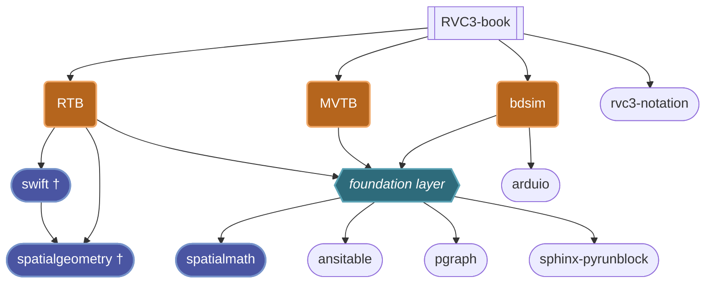

# RVC Ecosystem (`rvc-ecosystem`)

> The central hub, architectural map, and shared technical conventions for the **Robotics, Vision & Control (RVC)** Python software suite.

This repository serves as the high-level entry point for students, researchers, developers, and AI coding agents working with the RVC open-source ecosystem.

Some sections here overlap deliberately with [`AGENTS.md`](./AGENTS.md), covering the same ground for human readers. **Where the two disagree, `AGENTS.md` wins** — treat a conflict as this file having lagged behind a change, not as `AGENTS.md` being wrong.

---

## Ecosystem Architecture


† in the repos of `jhavl`

The "big 3" are highlighted in orange, third party repos I contribute to in blue.

### Ecosystem status

Live CI, PyPI, and issue/PR status across every repo in the ecosystem: [status.html](https://petercorke.github.io/rvc-ecosystem/status.html).

## Core Packages

The RVC ecosystem consists of several interconnected Python packages designed for spatial mathematics, robot kinematics/dynamics, block-diagram simulation, and computer vision. These are the "big 3":

| Package | Purpose | Primary Documentation / Repo |
| :--- | :--- | :--- |
| **`robotics-toolbox-python`** | Serial-link manipulators, mobile robot motion, trajectory generation, kinematics & dynamics | [petercorke/robotics-toolbox-python](https://github.com/petercorke/robotics-toolbox-python) |
| **`machinevision-toolbox-python`** | 2D and 3D vision  | [petercorke/machinevision-toolbox-python](https://github.com/petercorke/machinevision-toolbox-python) |
| **`bdsim`** | Block-diagram simulation of dynamic systems in Python | [petercorke/bdsim](https://github.com/petercorke/bdsim) |

The backing group is 


| Package | Purpose | Primary Documentation / Repo |
| :--- | :--- | :--- |
| **`spatialmath-python`** | 2D/3D coordinate transformations, $SO(2)$, $SE(2)$, $SO(3)$, $SE(3)$, quaternions, Lie groups | [rai-opensource/spatialmath-python](https://github.com/rai-opensource/spatialmath-python) † |
| **`swift`** | Browser-based 3D visualizer for robot/scene simulation | [jhavl/swift](https://github.com/jhavl/swift) † |
| **`spatialgeometry`** | Geometric primitive and mesh classes used by `swift`/RTB for scene rendering | [jhavl/spatialgeometry](https://github.com/jhavl/spatialgeometry) † |
| **`ansitable`** | Pretty ANSI-colored display of tabular data/matrices in the terminal | [petercorke/ansitable](https://github.com/petercorke/ansitable) |
| **`pgraph-python`** | Simple graph classes used for path/roadmap planning | [petercorke/pgraph-python](https://github.com/petercorke/pgraph-python) |
| **`sphinx-pyrunblock`** | Sphinx extension that executes code blocks and inlines their output in the docs | [petercorke/sphinx-pyrunblock](https://github.com/petercorke/sphinx-pyrunblock) |
| **`arduIO`** | Simple Arduino I/O server and Python client, used by `bdsim` hardware blocks | [petercorke/arduIO](https://github.com/petercorke/arduIO) |
| **`rvc-notation`** | Shared mathematical notation reference for the ecosystem | [petercorke/rvc-notation](https://github.com/petercorke/rvc-notation) |
| **`RVC3-python`** | Python code examples for the *Robotics, Vision & Control*, 3rd ed. textbook | [petercorke/RVC3-python](https://github.com/petercorke/RVC3-python) |

† Third-party owned (RAI/`jhavl`) — Peter contributes via PR rather than direct push.


---

## Shared Development Standards

**This section is aspirational — it describes the target end-state, not a claim that every repo already meets it.** Each repo can be tested against these measures individually; gaps become tracked work (a GitHub issue labelled `tech-debt`, see below), not silent inconsistency.

This standard applies directly to the repos Peter maintains and governs outright: the "big 3" (RTB, MVTB, bdsim), plus `ansitable`, `pgraph-python`, `sphinx-pyrunblock`, `arduIO`, `rvc-notation`, `RVC3-python`. For the third-party-owned repos (`spatialmath-python`, `swift`, `spatialgeometry`) it describes what's proposed via PR, not something imposed unilaterally — and `spatialmath-python` additionally sits under RAI-Inst's own governance, so changes there follow their process, not this one.

### Git & PR workflow

* one branch per change set — no unrelated concerns (feature, refactor, fix, docs) tangled together, no size exception
* a new branch is proposed and confirmed before the first edit, every time — not decided unprompted and reported after the fact
* third-party-owned repos (`spatialmath-python`, `swift`, `spatialgeometry`) always go through a PR, even where direct/collaborator push access exists
* merging or opening a PR is confirmed individually — approval for one doesn't carry forward to the next
* closing an issue or PR filed by an external contributor always gets a friendly comment first, never a silent close

### All CI

* common logic
* dependabot automerge
* release-please support on the big 3 — hit real problems in two projects, see [machinevision-toolbox-python#74](https://github.com/petercorke/machinevision-toolbox-python/pull/74) before assuming this is a solved/simple aspiration
* GitHub issue-forms (`.yml`) and a PR template, modeled on MVTB; Discussions enabled with blank issues disabled in favour of it
* branch protection on the big 3, with required checks audited so a path-filtered workflow can't permanently block an unrelated category of PR (e.g. docs-only)


### Build and test infrastructure

* Package Management: Modern `src/` layout monorepo/package structures
* Code Formatting & Linting: `ruff` (formatter + linter), superseding `black`
* Build Backend [Hatch](https://hatch.pypa.io/) (`hatchling`)
* C++ extensions are handled with `nanobind` and `scikit-build-core`
* enable dependabot like MVTB

### Code quality

* type hinting with modern Python 3.10+ syntax (`X | Y`, `list[X]`, `dict[K, V]` — no `List`, `Union`, `Optional`)
* all public methods/functions must be hinted
* test coverage as per codecov > 80%, including at least one real (non-mocked) integration test for any component with a real I/O boundary (socket, HTTP, subprocess)
* Codacy score A
* every package has `__version__`
* all `repr` conform to the constructor-like string format
* no parameters or methods named `list` or `type`
* deprecation is critical to code evolution and user experience
  * a deprecated function should issue a warning and then return the expected result
  * a deprecated parameter should issue a warning and set the new parameter to its value, returning the expected result
  * docstrings should clearly describe the deprecation using the Sphinx `.. deprecated::` directive
  * all warning messages and docstrings must include the release tag from which the deprecation began.
  * all deprecations should be listed in the CHANGELOG (how?)
* pragma type comments (eg. # noqa, # lgtm) should be minimized.  Actively remove obsolete pragma comments such as #lgtm which were introduced for
  semmle operation years ago.

### Documentation

Accurate, readable and complete documentation is critical.

* use `sphinx-pyrunblock` examples (the migrated/renamed successor to `sphinx-autorun`)
* include `sphinx-copybutton` and `sphinx-codeautolink`
* all sphinx documentation pages have footer:
  * on left: "Copyright © 20xx-present, Peter Corke: built YYYY-MM-DD" where YYYY-MM-DD is the doco build time
  * on right: "GitHub" in smaller font (see bdsim) which is a link back to repo GH page.
* ensure that intersphinx links are correct, in particular check RAI-inst for spatialmath
* big 3 migrate to using sphinx cards like MVTB
* add `llms.txt` file — for library *users* (not contributors/agents working in the repo, hence out of scope for `AGENTS.md`); needs per-repo API knowledge, do in the context of each repo's own docs work when it comes up; low priority for now
* have a `CHANGELOG` (release-please-generated where applicable)

### Jupyter

* all should have teaser notebooks running under JupyterLite
* ideally every repo has a "Try it Now badge" like MVTB/bdsim that runs a JupyterLite environment in user's browser
* notebooks from the docs/notebooks folder are all available to run there
* whenever a notebook is committed a hook runs to clear output, to avoid cruft going into git
* notebooks will use a [standard bootstrap alert classes](https://getbootstrap.com/docs/4.0/components/alerts/) for notes/warnings etc.
* notebooks should start with a 2 column table that contains the heading and the toolbox/package logo
* running notebooks in different environments (desktop, jupyter, jupyterlite) requires custom cells, this is 
handled by the second cell
  * contains a special comment
  * has the code folding JSON tag set
  * prints a welcome message asking the user to wait, handles the specific logic, prints a helpful done message
  * to keep this up to date we use the process employed by MVTB with tools to keep the bootstrap cell up to date
* Issues with pyodide moving toward JSPI but not yet supported by Apple/Firefox. Means we have to pin to pyodide 0.6.1 which is long-term issue

### `README.md`

* logo
* tag line: opencv for humans; block diagram thinking -> python coding; etc.
* purpose of package, single line
* quick links to "Try it now", PyPI version, Docs link
* badges in standard order in 2 groups
  * *Status & Project Health* in order: CI passing, downloads, python, codecov, code quality (if decent).
  * *Ecosystem & Dependencies* collections followed by badges for major packages used, eg. Numpy, SciPy, spatial maths, OpenCV.

```
### Status & Project Health
[](https://github.com/petercorke/bdsim/actions/workflows/ci.yml)
[](https://pepy.tech/projects/bdsim)

[](https://codecov.io/gh/petercorke/bdsim)
[](https://opensource.org/licenses/MIT)

### Ecosystem & Dependencies
[](https://github.com/petercorke/robotics-toolbox-python)
[](https://qcr.github.io)

[](https://numpy.org)
[](https://scipy.org)
[](https://matplotlib.org)
[](https://github.com/petercorke/spatialmath-python)
```

Note the use of `pepy.tech` for the download stats, not subject to the rate limiting display

### Support files

* all notebooks should have Colab support and use %pip magic not !pip
* all notebooks should have output cleared at commit time
* all notebooks and examples are zipped at deploy time and posted as GH release assets


### Housekeeping

* Technical debt is tracked as **GitHub Issues labelled `tech-debt`** — the standard going forward. `ansitable` and `sphinx-pyrunblock` still carry a legacy `tech-debt.md` file (migration pending, not urgent); don't create a new one anywhere. See `AGENTS.md` §6.
* The `tech-debt` label color is consistent across repos; MVTB is the exemplar
* cross-session planning/handoff docs (a plan to execute next session, a bug handoff) 
  go in `claude-notes/` at repo   root — never left at the repo root itself
* GitHub Projects is used by Peter to organize future features, whims and bugs.  

## Github

* Issues, PR templates and Discussions enabled — for the repos Peter governs directly; third-party repos follow their own owners' settings
* `main` as the default branch, not `master`


## Guidance for AI Coding Agents

If you are an AI assistant (Claude Code, Cursor, Copilot, Codex, Gemini) working in any RVC ecosystem repo, read [`AGENTS.md`](./AGENTS.md) first. It defines:

- **Glossary** of shorthand names (RTB, MVTB, SMTB, SG, GH, JL, …)
- **Repo ownership and contribution rules** — critical for third-party-owned repos
- **Mathematical invariants** that must not be violated
- **Package dependency boundaries**
- **Code standards** (type hints, docstrings, deprecation, build tooling)
- **Tech-debt tracking** (GitHub Issues, not files)

